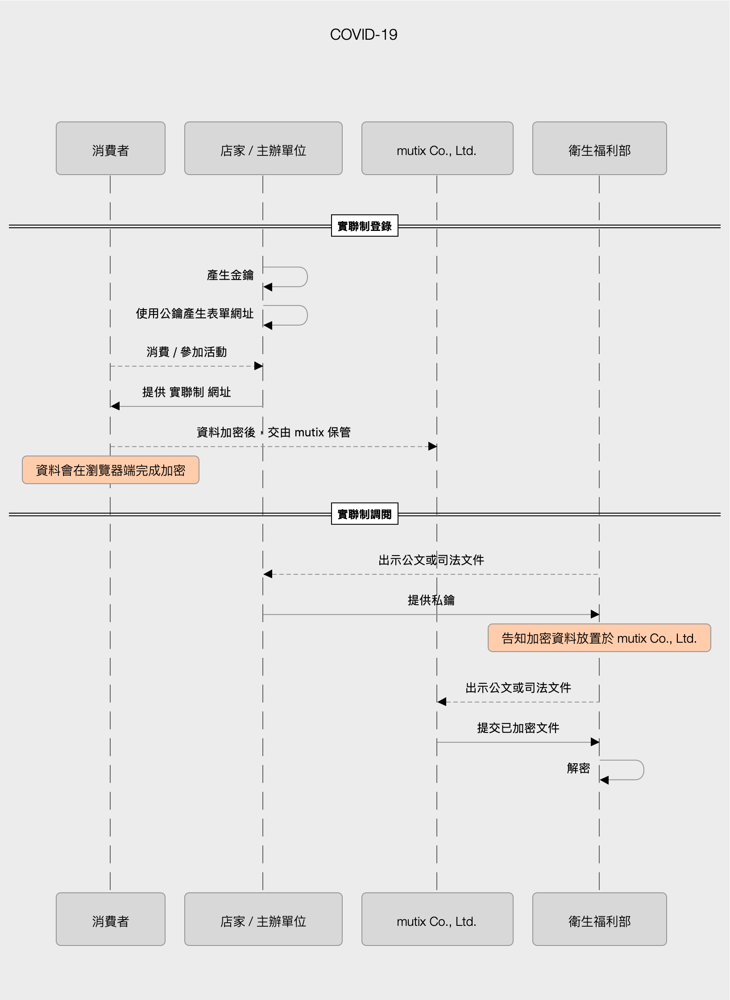

# covid19
因應 COVID-19 防疫新生活運動實施實聯制措施，提供確保隱私的服務

# 相關規定

「COVID-19(武漢肺炎)」防疫新生活運動：實聯制措施指引
修訂日期：2020/05/29

一、為維持國內疫情之穩定控制，使民眾生活及產業經濟能於具備一定安全條件下，逐步恢復正常運作，公務機關或非公務機關(以下皆簡稱機關)應依循本指引之說明，採行實聯制措施。

二、為增加整體防疫措施之透明性、提高民眾之信賴，機關

蒐集民眾個人資料時，應明確告知下列事項：

(一) 蒐集機關之名稱。

(二) 蒐集之目的：防疫目的，依據「個人資料保護法之特定目的及個人資料之類別」為代號 012 公共衛生或傳染病防治之特定目的，且不得為目的外利用。

(三) 蒐集之個人資料項目：蒐集資料應符合最少侵害原則，如電話號碼。

(四) 個人資料利用之期間：自蒐集日起 28 日內。

(五) 個人資料利用之對象及方式：為防堵疫情而有必要時，得提供衛生主管機關依傳染病防治法等規定進行疫情調查及聯繫使用。

(六) 當事人就其個人資料得依個人資料保護法規定，向蒐集之機關行使權利，包括查詢或請求閱覽、請求製給複製本、請求補充或更正、請求停止處理或利用、請求刪除，及行使方式。

(七) 當事人不同意提供個人資料對其權益之影響，如無法進入場館或參與活動。告知時可採取「多層次告知」方式，將重要事項於明顯處揭示，並以 QR Code 或網址連結提供其他細節事項。

三、機關為蒐集、處理及利用個人資料，得以紙本或電子方式為之，且皆應善盡資料安全維護義務，採行適當之技術上及組織上安全措施，並指定專人辦理安全維護事項，防止個人資料被竊取、竄改、毀損、滅失或洩漏。例如以紙本供當事人填具個人資料時，應以遮蔽或其他適當方式保護填寫者之個人資料，避免後填寫者得閱覽先填寫者之個人資料。

四、 機關以資訊系統或 APP 實施實聯制者，應進行資訊安全風險評估，採行相符安全控制措施，確保系統安全防護水準。

五、各機關對於蒐集之個人資料僅可保存 28 日，屆期即應主動將個人資料予以刪除或銷毀，並應留存執行刪除或銷毀之項目及日期等軌跡紀錄。

六、各中央目的事業主管機關、直轄市、縣（市）政府應依個人資料保護法第 22 條規定，監督所轄非公務機關，落實執行上開個人資料保護事項，以兼顧民眾資訊隱私權之保障。

# 運作流程 登錄 與 調閱

# 參與貢獻

1. Git Clone
2. run `yarn develop`
3. `git cz` for commit
4. Create pull request

# 授權

專案採用 [AGPL 3.0](https://www.gnu.org/licenses/agpl-3.0.html) 且 [貢獻者](https://github.com/mutix-co/covid19/graphs/contributors) 保留其著作人格權